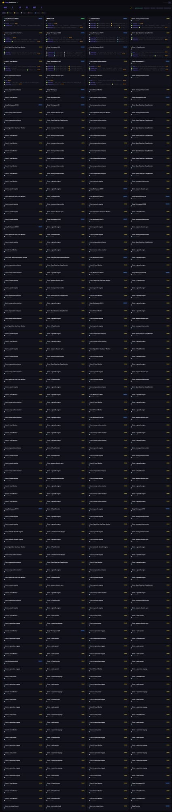

# 🖥️ OpenClaw Sessions Dashboard

> A real-time web dashboard for monitoring and managing all your [OpenClaw](https://github.com/openclaw/openclaw) AI agent sessions — built by **[Sujal Manpara](https://github.com/sujalmanpara)**.



## What is this?

If you run OpenClaw (a self-hosted AI assistant gateway), this dashboard gives you a live window into everything happening inside it — all agents, sessions, sub-agents, cron jobs, and more. No more flying blind.

Built and battle-tested by Sujal as part of his personal Jarvis AI setup — where he runs multiple AI agents including a background worker bot (Spidey 🕷️) that handles heavy tasks while Jarvis stays free to chat.

---

## ✨ Features

### 🔴 Live Session Monitoring
- Auto-refreshes in real-time via WebSocket
- See every active session at a glance — main agent, sub-agents, cron runs, Telegram DMs, group chats
- Color-coded session types and statuses

### 🕷️ Multi-Agent Support
- Monitors **all agents** simultaneously (not just `main`)
- If you run sub-agents like Spidey, they show up under the **sub-agents** tab
- Tracks session type: `main`, `subagent`, `cron-run`, `telegram`, etc.

### 📋 Activity Feed
- See tool calls (🔧), responses (💬), and thinking (🧠) in real-time
- Per-entry cost tracking in transcripts
- Full transcript viewer — click any session to dive in

### ⏰ Cron Job Management
- View all scheduled cron jobs
- Enable / disable / trigger them manually
- View run history for each job

### 🔑 API Key Manager
- View and manage your API key profiles
- Test keys directly from the dashboard

### 📊 Stats Bar
- Total sessions, active count, cron jobs, groups at a glance
- Cost tracking: today / this week / this month

### 🎨 Dark Theme
- Easy on the eyes for long sessions

---

## 🚀 Quick Start

### 1. Clone

```bash
git clone https://github.com/sujalmanpara/openclaw-sessions-dashboard.git
cd openclaw-sessions-dashboard
```

### 2. Install dependencies

```bash
pip install watchdog websockets
```

### 3. Run

```bash
python3 serve.py
```

Open **http://localhost:3847** in your browser.

That's it. Zero config needed if OpenClaw is installed in the standard location (`~/.openclaw`).

---

## ⚙️ Configuration (optional)

Everything is **auto-detected** from your home directory. But you can override with environment variables:

| Env Var | Default | Description |
|---------|---------|-------------|
| `OPENCLAW_DIR` | `~/.openclaw` | Path to your OpenClaw data directory |
| `DASHBOARD_PORT` | `3847` | HTTP port for the dashboard |
| `DASHBOARD_WS_PORT` | `3848` | WebSocket port for live updates |

Example:
```bash
OPENCLAW_DIR=/custom/path DASHBOARD_PORT=8080 python3 serve.py
```

---

## 📁 File Overview

| File | Description |
|------|-------------|
| `serve.py` | Main Python server — all API endpoints + file watching |
| `index.html` | Sessions dashboard — live feed, session list, transcripts |
| `cron.html` | Cron job manager — view, toggle, trigger, run history |
| `session.html` | Detailed session view with full transcript |
| `system.html` | System overview — services, memory, uptime |
| `keys.html` | API key profiles manager |
| `send-message.mjs` | Utility to send messages to sessions via gateway |

---

## 🔌 API Endpoints

| Endpoint | Method | Description |
|----------|--------|-------------|
| `GET /` | GET | Main dashboard UI |
| `GET /data/sessions.json` | GET | All sessions (all agents merged) |
| `GET /data/transcript/:id` | GET | Full transcript for a session |
| `GET /data/cron-jobs.json` | GET | All cron jobs |
| `GET /data/cron-runs/:jobId` | GET | Run history for a cron job |
| `POST /api/cron/toggle` | POST | Enable/disable a cron job |
| `POST /api/cron/run` | POST | Trigger a cron job manually |
| `POST /api/send-message` | POST | Send a message to a session |
| `WS ws://localhost:3848` | WS | Real-time session update stream |

---

## 🛠️ Requirements

- Python 3.8+
- `pip install watchdog websockets`
- A running [OpenClaw](https://github.com/openclaw/openclaw) instance

---

## 🕷️ The Spidey Setup (inspiration)

This dashboard was built for a multi-agent setup where:

- **Jarvis** = main AI assistant (talks to Sam via Telegram)
- **Spidey** = background worker bot (spawned by Jarvis for heavy tasks)

When Jarvis gives a big task to Spidey, this dashboard shows both agents running side by side — Jarvis in the main tab, Spidey under sub-agents. When Spidey finishes, Jarvis relays the results to Sam.

You can build the same setup with OpenClaw's `sessions_spawn` API.

---

## 📸 Dashboard Tabs

| Tab | What it shows |
|-----|--------------|
| **all** | Every session across all agents |
| **pinned** | Sessions you've pinned |
| **running** | Currently active (< 5 min ago) |
| **idle** | Recent but quiet (< 1 hour) |
| **groups** | Group chat sessions |
| **crons** | Cron job sessions |
| **sub-agents** | Sub-agent sessions (e.g. Spidey 🕷️) |
| **main** | Main agent session only |

---

## 🙋 About

Built by **Sujal Manpara** ([@sujalmanpara](https://github.com/sujalmanpara)) as part of a personal AI assistant setup using OpenClaw.

If this helped you, ⭐ the repo!

---

## 📄 License

MIT — use it, fork it, build on it.
